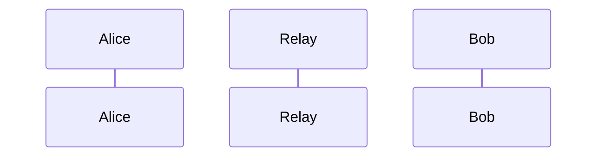

Hang ([moq-hang](https://www.ietf.org/archive/id/draft-lcurley-moq-hang-00.html)) enables building real-time conferencing applications over Media over QUIC (MoQ).

## Overview

### Flow



### Key Concepts
- **Room**: A collection of participants, each publishing under a common prefix.
- **Participant**: A broadcaster that can produce any number of media tracks.
- **Catalog**: A JSON document describing available media tracks, supporting live updates.
- **Track/Group/Frame**: Hierarchical structure for media delivery, supporting out-of-order and in-order delivery as needed.

### Discovery
Participants discover each other in a room using moq-lite's ANNOUNCE mechanism. Each participant publishes a broadcast with the room path as a prefix (e.g., `/room/alice.hang`). Discovery is dynamic, and presence is updated live.

### Catalog
Each participant can publish a `catalog.json` track describing their available audio and video tracks, using a schema compatible with W3C WebCodecs. Catalogs are updated live as tracks change.

#### Example Video Track (from the draft):
```json
{
	"track": { "name": "video", "priority": 2 },
	"config": {
		"codec": "avc1.64001f",
		"codedWidth": 1280,
		"codedHeight": 720,
		"bitrate": 6000000,
		"framerate": 30.0
	}
}
```

#### Example Audio Track (from the draft):
```json
{
	"track": { "name": "audio", "priority": 1 },
	"config": {
		"codec": "opus",
		"sampleRate": 48000,
		"numberOfChannels": 2,
		"bitrate": 128000
	}
}
```

### Media Delivery
Media tracks are split into groups and frames. Each group starts with a keyframe (for video), and frames are timestamped for synchronized playback.

For more details, see the [IETF draft](https://www.ietf.org/archive/id/draft-lcurley-moq-hang-00.html).