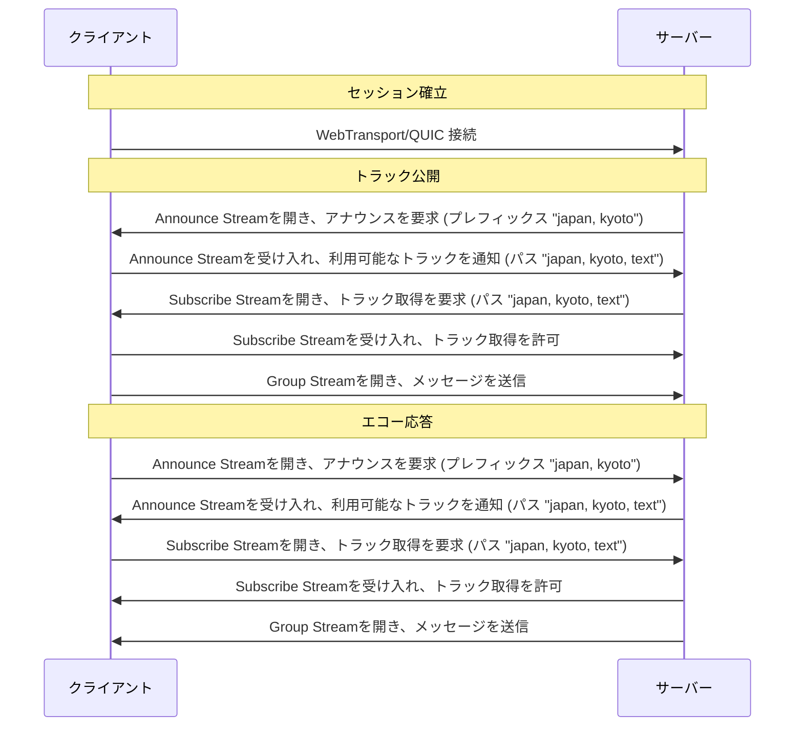

# MOQT エコーサンプル

MOQT (Media over QUIC Transport) を使用したシンプルなエコーサーバーとクライアントの実装例です。

## 概要

このサンプルは、シンプルなエコーサービスを実装することでMOQTの基本的な使用方法を示しています。サーバーはクライアントからメッセージを受信し、トラックパスを使用してMOQTトラックを通じてそのメッセージをエコーバックします。

## プロトコルフロー



## 実装の詳細

### クライアント側の実装

#### 1. 接続確立
- WebTransportとraw QUICの両方の接続をサポート
- サーバーとのセキュアな接続を確立

#### 2. トラック公開
- **アナウンスフェーズ**
  - サーバーからの"japan, kyoto"プレフィックスを持つトラックのAnnounce Stream要求を受け入れ
  - "japan, kyoto, text"パスを持つトラックをアナウンス
  - サーバーからの購読リクエストを処理
- **メッセージ送信**
  - メッセージ配信用のGroup Streamを作成
  - Frameメッセージを使用してサーバーにメッセージを送信

#### 3. トラック購読
- **トラック発見**
  - "japan, kyoto"プレフィックスを持つトラックのAnnounce Streamを開始
  - サーバーからのトラックアナウンスを処理
- **メッセージ受信**
  - 一致するパスを持つアナウンスされたトラックを購読
  - Group Streamを通じてエコーメッセージを受信

### サーバー側の実装

#### 1. セッション管理
- 着信接続の処理
- クライアントセッションの管理
- WebTransportとQUICの両プロトコルをサポート

#### 2. エコーサービス
- **トラック発見**
  - "japan, kyoto"プレフィックスを持つトラックのアナウンスを要求
  - クライアントからのトラックアナウンスを処理
- **エコー処理**
  - クライアントのアナウンスされたトラックを購読
  - 一致するパス構造でエコートラックを作成
  - クライアントからの購読を処理
  - 受信したメッセージをGroup Streamを通じてエコーバック

## クイックスタート

### 前提条件
- Go 1.22以降
- 開発用証明書（`just generate-cert`で生成）

### サンプルの実行

1. **サーバーの起動**
   ```bash
   just run-echo-server
   ```
   リッスンアドレス:
   - `https://localhost:4443/echo` (WebTransport)
   - `moqt://localhost:4443/echo` (QUIC)

2. **クライアントの実行**
   ```bash
   just run-echo-client
   ```

## プロジェクト構造

```
echo/
├── server/
│   └── main.go    # エコーロジックを含むサーバー実装
└── client/
    └── main.go    # メッセージ処理を含むクライアント実装
```

## 学習ポイント

このサンプルで学べること:
- MOQT接続の確立方法
- トラックのアナウンスと購読の仕組み
- 双方向メッセージフロー
- ストリーム管理
- エラーハンドリング

## ライセンス

このサンプルはgomoqtプロジェクトの一部であり、[ライセンス](../LICENSE)の下で提供されています。