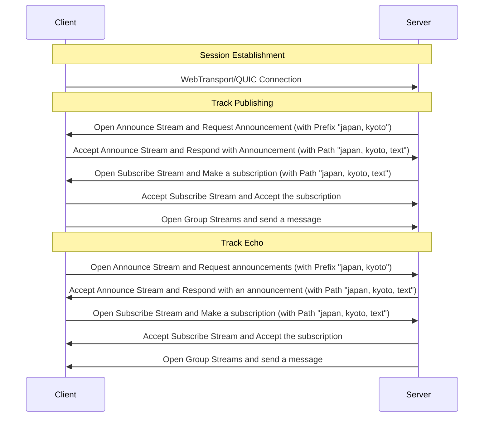

# MOQT Echo Example

A simple echo server and client implementation using MOQT (Media over QUIC Transport).

## Overview

This example demonstrates the basic usage of MOQT by implementing a simple echo service. The server receives messages from clients and echoes them back through MOQT tracks using track paths.

## Protocol Flow



## Implementation Details

### Client Side Implementation

#### 1. Connection Establishment
- Supports both WebTransport and raw QUIC connections
- Establishes secure connection with the server

#### 2. Track Publishing
- **Announce Phase**
  - Accepts server's Announce Stream request for tracks with prefix "japan, kyoto"
  - Announces track with path "japan, kyoto, text"
  - Handles server's subscription request
- **Message Sending**
  - Creates Group Stream for message delivery
  - Sends messages using Frame message format

#### 3. Track Subscription
- **Track Discovery**
  - Initiates Announce Stream for tracks with prefix "japan, kyoto"
  - Processes track announcements from server
- **Message Reception**
  - Requests access to available track with matching path
  - Receives echoed messages through Group Stream

### Server Side Implementation

#### 1. Session Management
- Handles incoming connections
- Manages client sessions
- Supports both WebTransport and QUIC protocols

#### 2. Track Echo Service
- **Track Discovery**
  - Requests announcements for tracks with prefix "japan, kyoto"
  - Processes client track announcements
- **Echo Processing**
  - Subscribes to client's announced track
  - Creates echo track with matching path structure
  - Handles client subscriptions
  - Echoes received messages back through Group Stream

## Quick Start

### Prerequisites
- Go 1.22 or later
- Development certificates (via `just generate-cert`)

### Running the Example

1. **Start the Server**
   ```bash
   just run-echo-server
   ```
   Listens on:
   - `https://localhost:4443/echo` (WebTransport)
   - `moqt://localhost:4443/echo` (QUIC)

2. **Run the Client**
   ```bash
   just run-echo-client
   ```

## Project Structure

```
echo/
├── server/
│   └── main.go    # Server implementation with echo logic
└── client/
    └── main.go    # Client implementation with message handling
```

## Learning Points

This example demonstrates:
- MOQT connection establishment
- Track announcement and subscription
- Bidirectional message flow
- Stream management
- Error handling

## License

This example is part of the gomoqt project and is licensed under the [License](../LICENSE).
